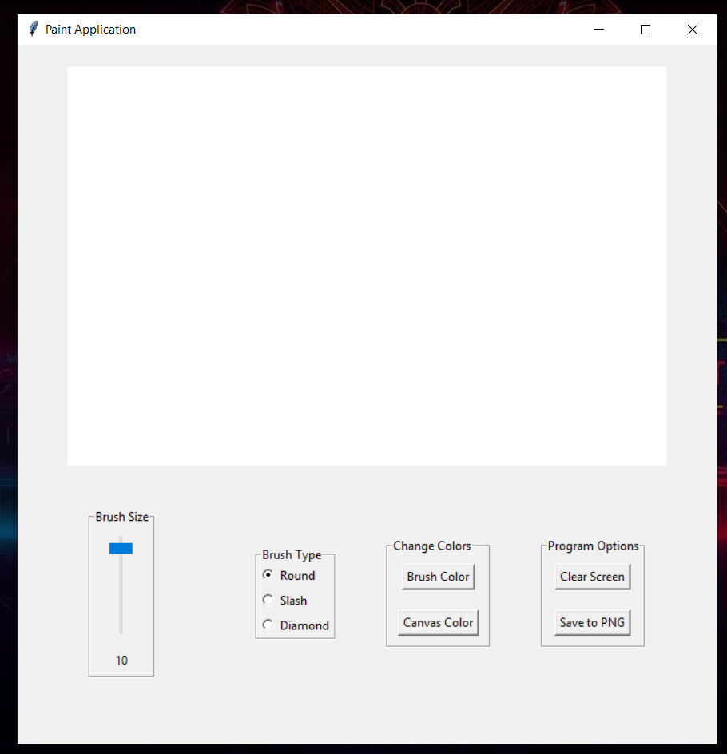

# Painting-Application
Painting Application built using Python  library Tkinter
Has basic features such as painting with different options as brush options, canvas clors, brush colors and etc.

To use the project
1. Clone the repo
2. pip intall Pillow 
3. Run Paint.py in any code editor.

In order to create an executable file, run the command
> pip install pyinstaller
> pyinstaller --onefile --windowed paint.py
Then you will have the excutable file

